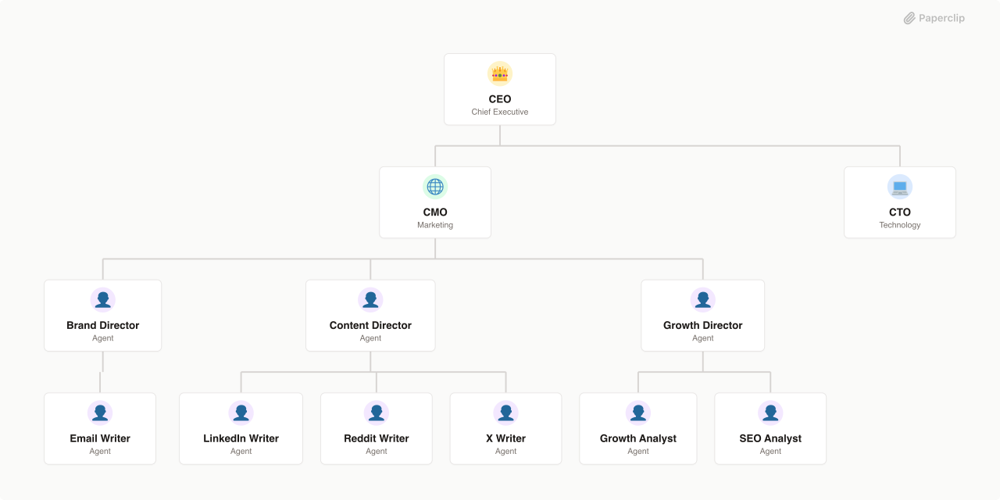

# ACENT



## What's Inside

> This is an [Agent Company](https://agentcompanies.io) package from [Paperclip](https://paperclip.ing)

| Content | Count |
|---------|-------|
| Agents | 12 |
| Skills | 12 |

### Agents

| Agent | Role | Reports To |
|-------|------|------------|
| Brand Director | general | cmo |
| CEO | CEO | — |
| CMO | general | ceo |
| Content Director | general | cmo |
| CTO | CTO | ceo |
| Email Writer | general | brand-director |
| Growth Analyst | general | growth-director |
| Growth Director | general | cmo |
| LinkedIn Writer | general | content-director |
| Reddit Writer | general | content-director |
| SEO Analyst | general | growth-director |
| X Writer | general | content-director |

### Skills

| Skill | Description | Source |
|-------|-------------|--------|
| expert-panel | >- | catalog |
| conversion-ops | — | catalog |
| finance-ops | AI-powered financial analysis suite. Generates executive CFO briefings from QuickBooks exports (P&L, Balance Sheet, General Ledger, Cash Flow, etc.) with anomaly detection, burn rate, runway analysis, and scenario modeling. Also estimates codebase development costs with organizational overhead and AI ROI analysis. Triggers on: 'CFO briefing', 'financial analysis', 'cost briefing', 'expense review', 'runway analysis', 'burn rate', 'cost estimate', 'how much would this cost to build', 'development cost', 'Claude ROI'. | catalog |
| growth-engine | — | catalog |
| cold-outbound-optimizer | Design, analyze, and optimize cold outbound email campaigns for Instantly. Handles end-to-end ICP definition, expert panel scoring (recursive to 90+), sequence copywriting, infrastructure audit, capacity planning, and implementation docs. Use when asked to build cold outbound sequences, optimize cold email, analyze outbound campaigns, build sales sequences, build Instantly sequences, create cold outbound strategies, or design email campaigns. Supports both "start from scratch" and "optimize existing" modes. | catalog |
| revenue-intelligence | — | catalog |
| seo-ops | — | catalog |
| team-ops | — | catalog |
| paperclip-create-agent | > | [github](https://github.com/paperclipai/paperclip/tree/master/skills/paperclip-create-agent) |
| paperclip-create-plugin | > | [github](https://github.com/paperclipai/paperclip/tree/master/skills/paperclip-create-plugin) |
| paperclip | > | [github](https://github.com/paperclipai/paperclip/tree/master/skills/paperclip) |
| para-memory-files | > | [github](https://github.com/paperclipai/paperclip/tree/master/skills/para-memory-files) |

## Getting Started

```bash
pnpm paperclipai company import this-github-url-or-folder
```

See [Paperclip](https://paperclip.ing) for more information.

---
Exported from [Paperclip](https://paperclip.ing) on 2026-04-11
